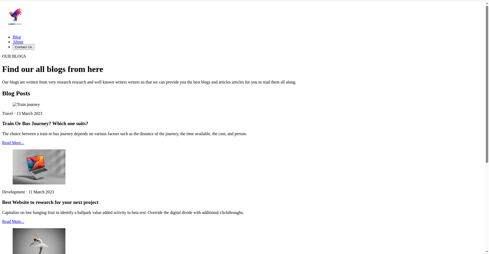
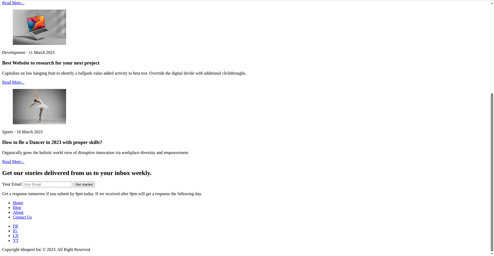

# Day 1 – Semantic HTML Blog Page

## Objective
The goal of this task was to understand and implement **semantic HTML5 elements** by building a **blog webpage layout** without using any CSS or JavaScript.

## What I built
I created a static **blog page** consisting of:
- A **Header** with navigation and logo
- A **Blog introduction section**
- A **Blog posts section** containing multiple articles
- A **Newsletter subscription form**
- A **Footer** with navigation and social links

The entire structure is built using **semantic HTML elements only**.

## What I learned

### 1- Semantic HTML
Used semantic elements to create meaningful structure:
- `<header>` – Page and section headers
- `<nav>` – Navigation menus
- `<main>` – Main content wrapper
- `<section>` – Grouping related content
- `<article>` – Individual blog posts
- `<footer>` – Footer content

### 2- Blog Article Structure
Each blog post is structured using:
- `<article>` to represent a standalone blog post
- `<figure>` and `` for blog images
- `<time>` for publish dates
- `<header>` and `<footer>` inside articles for better clarity

### 3- Forms and Accessibility
Learned how to:
- Create a form using `<form>`, `<label>`, and `<input>`
- Use `type="email"` for built-in validation
- Improve accessibility using:
  - `alt` attributes for images
  - `aria-label` for social media links
  - Proper label–input association

### 4- Content Hierarchy
Used proper heading levels:
- `<h1>` for main page heading
- `<h2>` for section headings
- `<h3>` for blog titles

## Files Used
- `index.html` – Complete semantic HTML structure
- `images/` – Blog images and logo assets

## Output
A clean, well-structured **semantic blog page** built entirely with HTML5, serving as a strong foundation for adding CSS and JavaScript in later stages. The output screenshots are being shown below:

