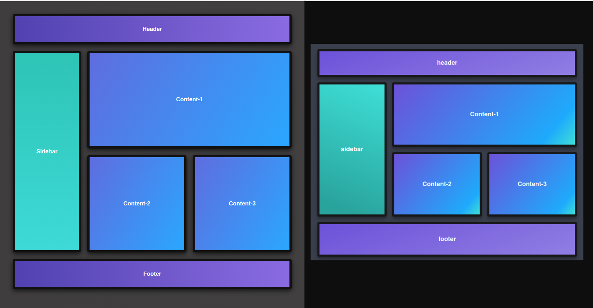

# Day 2 - CSS Layout (Flexbox + Grid)

## Objective
The goal of this task was to understand and implement **CSS layout techniques**, specifically **Fleaxbox** and **CSS Grid**, by creating a replica of given reference layout.

## What I built
I created a responsive webpage layout consisting of:
- A **Header**
- A **Sidebar**
- A **Content Area** having 3 content blocks
- A **Footer**

The layout adapts to different screen sizes using media queries.

## What I learned

### 1- Flexbox
Used flexbox for:
- Structuring the overall page (`body`) in a column layout
- Centering content vertically and horizontally.

Key properties used:
- `display: flex`
- `flex- direction`
- `align-items`
- `justify-content`
- `flex-1`

### 2- CSS Grid
Used grid for:
- Creating the main two-column layout (sidebar+content)
- Internal content structure

Key properties used:
- `display: grid`
- `grid-template-columns`
- `grid-column`
- `gap`

Example:
- Sidebar and content are placed using a **2-column grid**
- One content box spans across both columns using `grid-column: 1/-1`

### Responsiveness
Implemented responsiveness using:
- `@media (max-width: 768 px)`
- Switching from multi-column layout to single-column layout on smaller screens

This ensures the page remains usable on tablets and mobile devices.

## Files Used
- `index.html` - Semantic structure of the layout
- `style.css` - Styling using grid, flexbox and media queries
- `comparison.png` - visual comparison between reference design and final output

## Output Comparison

Below is the comparison between **reference image provided** (`right`) and **final output** (`left`):

