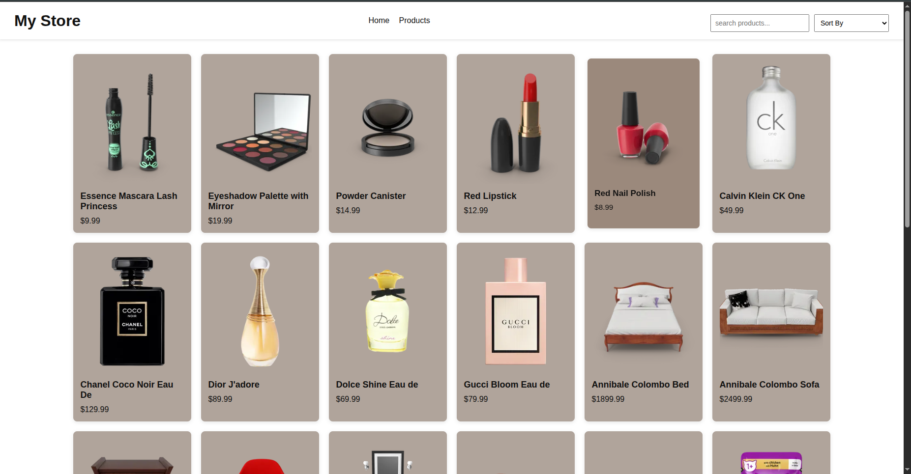
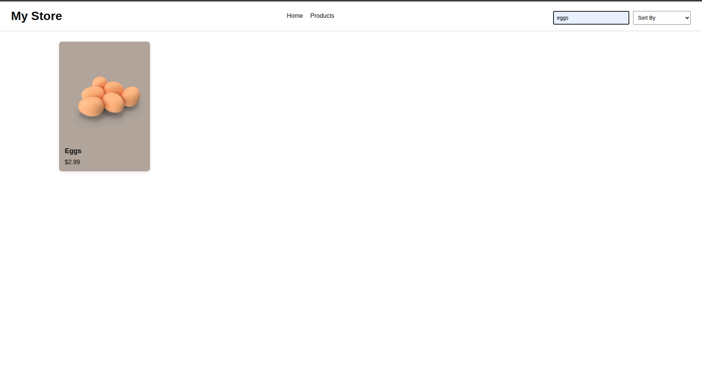
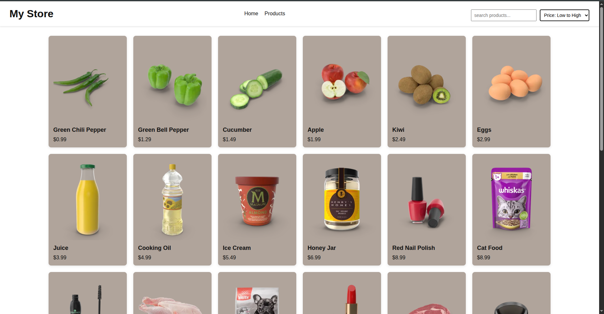
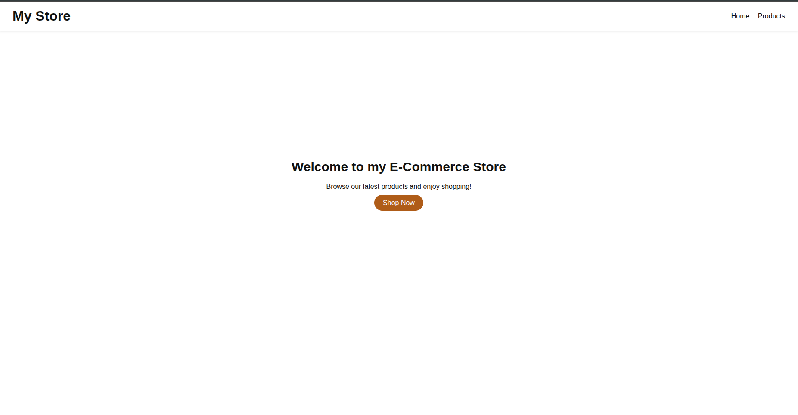

# Day 4 - E-Commerce Listing Page (JavaScript + DOM Manipulation)

## Objective
The goal of this task was to build a dynamic **E-Commerce Store interface** using **HTML, CSS, and JavaScript (ES6)** concepts.

The focus was on:

- Rendering products dynamically using JavaScript  
- Implementing a functional search feature  
- Managing UI layouts using CSS Grid  
- Handling DOM updates in real time without using any frameworks  


## What I built
I created a responsive **E-Commerce Website Interface** consisting of:

- Hero section with call-to-action button  
- Dynamic product listing page  
- Search functionality  
- Responsive grid layout  
- Product cards with image, title, and price

The website supports:

- Displaying products dynamically from JavaScript  
- Real-time search filtering  
- Consistent product card layout across pages  
- Centered and responsive grid system  


## What I learned

### 1 - ES6 Concepts

Used modern JavaScript features including:

- `const` and `let`  
- Arrow functions `(() => {})`  
- Template literals  
- Array methods (`forEach`, `filter`)  
- Dynamic HTML rendering using `innerHTML`  

Example:

```javascript
const filteredProducts = products.filter( product => 
        product.title.toLowerCase().includes(searchValue)
    );
```


### 2 - DOM Manipulation

Practiced:

- Selecting DOM elements  
- Rendering dynamic content  
- Updating the UI based on user input  
- Handling events  
- Managing layouts dynamically  

Key methods used:

- `document.getElementById()`  
- `document.querySelector()`  
- `addEventListener()`  
- `innerHTML`  
- `classList` methods  


### 3 - Dynamic Product Rendering

Instead of hardcoding products in HTML, products were fetched using given API using JavaScript.

Example:

```javascript
function renderProducts(productArray){
    productContainer.innerHTML="";

    productArray.forEach(product => {
        const card =document.createElement("div");
        card.classList.add("card");

        card.innerHTML= `
            
            <h3>${product.title}</h3>
            <p class="price">$${product.price}</p>
        `;

        productContainer.appendChild(card);
    });
}
```



This improved understanding of how data drives UI.


### 4 - Search Functionality

Implemented real-time product filtering using:

- `input` event listener  
- Array `filter()`  
- Dynamic re-rendering  

Behavior:

- As the user types, products update instantly  
- Only matching products are displayed  
- Layout remains consistent with the main products page  

This helped understand how UI state changes dynamically based on user interaction.



### 5 - Product Sorting Functionality

Implemented dynamic product sorting using a dropdown selection.

The sorting feature allows users to:

- Sort products by **Price: High to Low**
- Sort products by **Price: Low to High**
- Reset to default product order

This was achieved by:

- Listening to the `change` event on a `<select>` dropdown
- Using the ES6 spread operator (`...`) to clone the products array
- Applying the `sort()` method with a comparison function
- Re-rendering the updated product list dynamically

Example:




### 6 - CSS Grid Layout & Centering

Learned how to:

- Use CSS Grid for product layout  
- Control number of items per row  
- Center grid content properly  

Example:

```css
.product-grid {
    display: grid;
    grid-template-columns: repeat(auto-fill, 240px);
    justify-content: center;
    gap: 20px;
}
```

This improved layout structuring and responsiveness skills.


### 7 - UI & Layout Enhancements

Added:

- Card shadows for depth  
- Hover effects on buttons  
- Centered hero section using Flexbox  
- Responsive design adjustments  


## Files Used

- `index.html` - Homepage structure and layout  
- `products.html` - Products listing page structure and layout
- `style.css` - Styling, grid system, responsiveness  
- `script.js` - Product rendering logic and search functionality  


## Output

The final output is a fully functional E-Commerce Store interface that:

- Dynamically displays products  
- Filters products using search  
- Maintains consistent UI layout  
- Uses modern JavaScript (ES6)  
- Does not rely on any frameworks  


