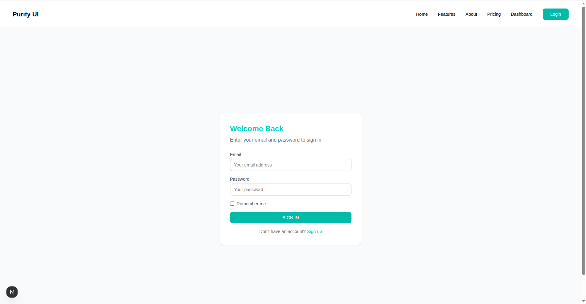
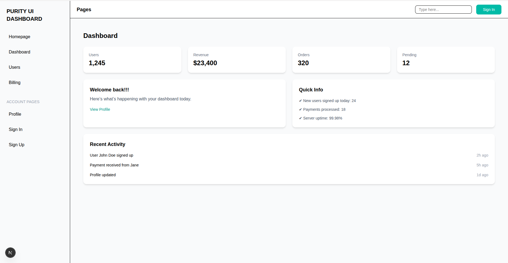
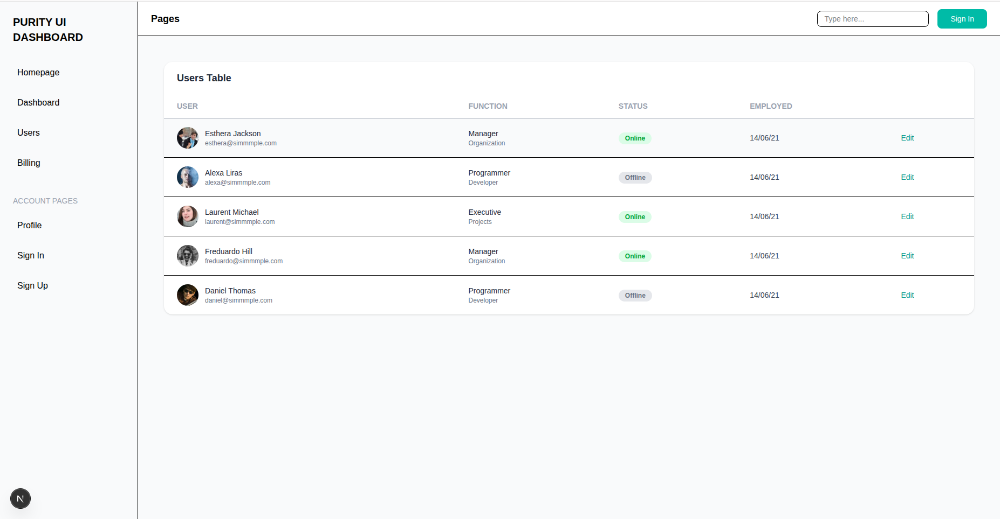
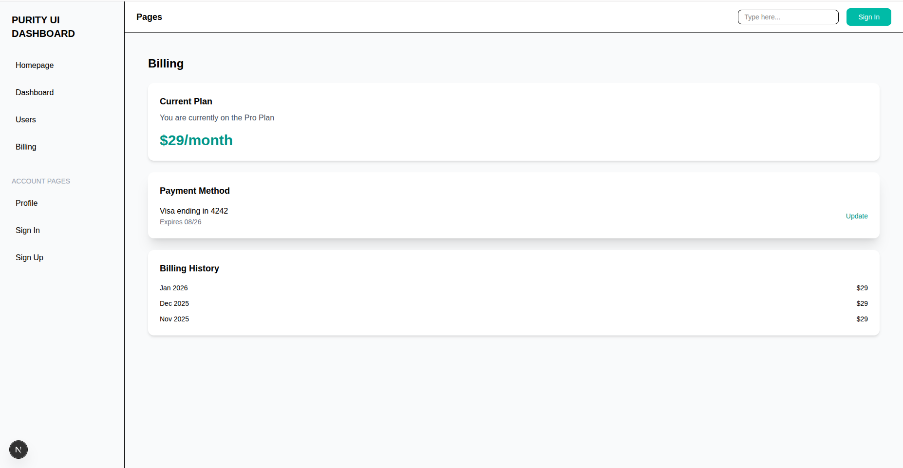

# Purity UI Dashboard (Next.js)

A responsive dashboard application built using **Next.js (App Router)** and **Tailwind CSS**, inspired by the Purity UI design system.  
This project focuses on routing, nested layouts, reusable components, and responsive UI design.

---

##  Tech Stack

- Next.js (App Router)
- React
- Tailwind CSS
- JavaScript (ES6+)

---

## Screenshots

> Screenshots are stored inside the `/public/screenshots` folder.

### Landing Page


### Sign In Page


### Features Page


### Dashboard


### Users Page


### Billing Page


### Profile Page


---

##  Folder Structure

├── app
│ ├── about
│ │ └── page.jsx
│ ├── dashboard
│ │ └── page.jsx
│ ├── features
│ │ └── page.jsx
│ ├── pricing
│ │ └── page.jsx
│ ├── signIn
│ │ └── page.jsx
│ ├── signUp
│ │ └── page.jsx
│ ├── globals.css
│ ├── layout.jsx
│ ├── menu.png
│ └── page.jsx
│
components/
└── ui/
├── Button.jsx
├── Input.jsx
├── Card.jsx
├── Badge.jsx
└── Modal.jsx
public/
└── screenshots/


---

##  Reusable UI Components

All reusable UI components are stored in:


/components/ui/


### Components List

- **Button**
  - Used for actions and navigation
  - Includes hover states and transitions

- **Input**
  - Reusable input field component
  - Used in Sign In and Sign Up pages

- **Card**
  - Used for dashboard stats, profile sections, and layouts

- **Badge**
  - Displays statuses such as Active, Inactive, and Plan types

- **Modal**
  - Base component for dialogs and overlays (extendable)

---

##  Routing & Layout System

This project uses **Next.js App Router** with nested layouts.

- `layout.jsx` inside `/dashboard` keeps the sidebar and navbar persistent
- Page content changes without reloading the layout

### Routes Implemented

- `/`Landing Page
- `/about`
- `/signIn`
- `/signUp`
- `/dashboard`
- `/dashboard/tables`
- `/dashboard/billing`
- `/dashboard/profile`

---

## Responsiveness

- Mobile-first design using Tailwind CSS
- Sidebar hidden on smaller screens
- Responsive grids:

grid-cols-1 md:grid-cols-2 lg:grid-cols-4

- Tables scroll horizontally on mobile devices
- Text, spacing, and buttons adapt to screen size

---

##  Lessons Learned

- File-based routing using **Next.js App Router**
- Implementing **nested layouts** for shared UI
- Building reusable UI components
- Understanding **Client Components vs Server Components**
- Creating responsive layouts with Tailwind CSS
- Structuring a scalable frontend project
- Debugging routing and layout issues in Next.js

---

##  How to Run Locally

1. Install dependencies
 ```bash
 npm install

Start development server

npm run dev

Open in browser
 http://localhost:3000